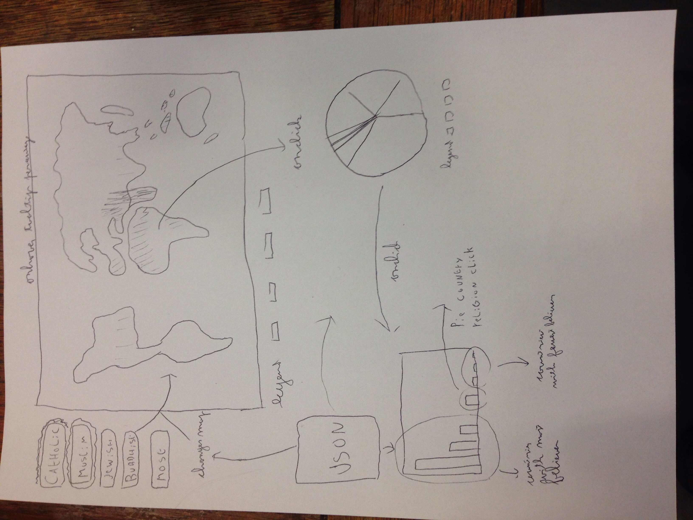

# programmeerproject

# new idea
omdat data verzamelen voor het muziek album idee niet haalbaar is bevonden, heb ik gekozen voor een andere aanpak en dataset. een dataset is gevonden waarin het percentage aanhangers van de populairdere religies onder de bevolking per land. hiermee wil ik een kaart maken waarop de aanhang van deze verschillende religies gemapt wordt. er zullen drie gelinkte visualisaties zijn die elk data halen uit een json waarin de percentages van bevolking die een bepaald geloof aanhangt per land bevat.

op de eerste visualistatie zal een wereldkaart getoont worden met een keuzemenu ernaast waarin je verschillende geloven kan kiezen. als je op een geloof klikt zie je met kleur in welke landen het percentage aanhangers hoog of laag is. ook kan je een total box aanlikken waarmee je kan zien in welke landen welk geloof het meest prominent aanwezig is. als je op een land klikt zal er een piechart aangepast worden die in het begin de geloofsverdeling in de hele wereld weergeeft. in een scatterplot staan verschillende geloven uitgebeeld tegenover sciale waarden. alledrie de grafieken zijn gelinked. als je op een land drukt in de kaart zal de pie worden geupdate en het land in de scatter worden gehighlighed. als je op een land klikt in de scatter zal de pie geupdate worden en als je op een geloof in de pie klikt zullen de kaart en de scatter geupdate worden met het corresponderende geloof

alle files voor het project staan in het mapje files

# tekeningen nieuwe design en links

# data source
http://www.pewforum.org/files/2012/12/globalReligion-tables.pdf
de land naam zal een string blijven in de database maar alle andere percentages en populaties zullen integers worden

