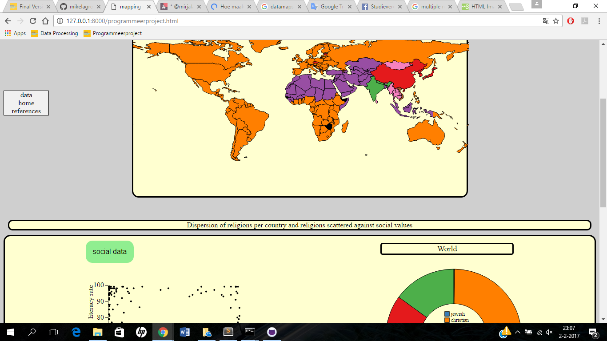

# Short discription

in pagina die ik in deze 4 weken heb gemakkt bestaat uit drie visualisaties over in kaart brengen van religies over de wereld. de eerste visualisatie is een datamap waarin je twee dingen kan zien. welke reigies het meest prominent zijn in de verschillende landen en hoe verschillende religies verspreid zijn over de wereld. met buttons kan je tussen deze functies switchen. in de tweede visualasatie kan je zien per land hoe verschillende religies zijn verdeeld onder de bevolking met een donut chart. deze wordt upgedate als je op een land klikt. in de derde visualasatie kun je met een scatterplot zien hoe percentages aanhangers van een religie per land staan tegenover litaricy rate, life expectancy and happiness index.

# Technical design

drie visualisaties zijn interactief in de pagina; de kaart, de donutchart en de scatter. alle drie zijn met elkaar en met buttens/dropdowns verbonden. de data van de kaart wordt aangepast als er op buttons met verschillende religies wordt gedrukt. er komt dan data over de percentages inwoners die deze religie aanhangen. ook is er een knopje most die data naar de kaart stuurt over welke religie in elk land het meest prominent aanwezig is. als er op de buttons geklikt wordt met religies zal ook de scatterplot geupdate worden. als er op een land geklikt wordt zal de bijbehorende piechart van dat land getekent worden en zal het land in de scatterplot met blauw gehighlight worden. in de piechart waarin je verdeling van geloven in een bepaald land kan zien zullen de arcs door groter te worden gehighlight worden. als je op een van de arcs klikt zal de scatterplot geupdate worden corresponderend met de geklikte religie. er kan in de scatterplot gewisseld worden van sociale maatstaaf door een dropdown menu. de twee variabelen worden ook opgeslagen in een current variable waardoor als je een variabele verandert de andere niet mee veranderd. het maken en updaten van de verschillende visualisaties staat in functies waardoor alleen deze functie aangeroepen hoeft te worden om de hele visalisatie met nieuwe data te tekenen als er op een interactief element wordt gedrukt. functies voor het tekenen van de visualistaties staan in aparte files. ze updaten door de oude svg te verwijderen en daarna een visualisatie met nieuwe data te tekenen. de variabeles die niet per se elke keer opnieuw moeten worden vastgesteld worden gedeclared in de main file waarin ook de functies worden aangeroepen. qua opmaak is er voor gekozen om de meest prominente geloven in de kaart en in de pie chart dezelfde kleur te geven (van colorbrewer) en een ander kleurenschema te maken voor het voorkomen van de verschillende religies. de knoppen waarmee je verschillende religies kan aanklikken zijn tevens de legenda van de most kaart. de pie chart heeft wel nog een aparte legenda omdat die vrij ver van de kaart afstaat. in de scatterplot is gekozen om de stippen zwart te houden omdat je per religie kan kijken.

# map

de map is de main visualisatie en staat gelinkt aan de buttons boven de pagina en aan alletwee de andere visualisaties. het tekenen en updaten van de map zijn in twee functies in de map.js file ondergebracht omdat voor de most map en de specifieke religies map de data anders behandeld moet worden en verschillende fillkeys gegeven worden. onhover verschijnt er een tooltip met prominente religie in de most en percentage religie in de specefieke religie maps. omdat de onclick interactie bij beiden soorten maps hetzelfde is wordt hier een aparte functie voor gebruikt, die de pie chart functie aanroept en daarmee update en de corrisponderende dot in de scatterplot highlight. ook wordt in de functies update map aan het einde de functie makescatter aangeroepen om de scatter te updaten naar de eventuele nieuwe religie. als een land aangeklikt wordt waar geen data voor aanwezig is zal een error gegeven worden op de plek waar de pie chart zou horen te komen

# pie

het maken en updaten van de pie chart staat in een functie makepie in pie.js. de pie update door simpelweg de oude svg te verwijderen en een nieuwe te tekenen. er zijn twee arc variables aangemaakt in de main file waardoor een arc groter kan worden op mouseover. onclick worden de scatter en de map geupdate naar de data van de religie die aangeklikt wordt met de functies updatedata en makescatter.

# scatter

de scatter plot wordt gemaakt door de functie makescatter in scatter.js hij update door de oude scatter te verwijderen en een nieuwe toe te voegen. de scatter wordt geupdate qua religie met de knoppen bovenaan en door te klikken op een religie in de barchart en wordt geupdate qua sociale waarde met een dropddown menu. als religie of social wordt geupdate wordt deze tevens opgeslagen in een current variabele om als een van de twee geupdate wordt niet de andere as automatisch te veranderen. als er op een dot wordt geklikt in de scatter wordt de pie chart geupdate voor het corresponderende land met de makepie functie. de scatter landen worden gehighlight als er op een land in de kaart gedrukt wordt.

# algemeen
algemene variabelen die niet in de functies geupdate hoeven te worden staan in de programmeerproject.js. ook is er een countrycodes.js waar een variabele met countrycodes staat en een functie om voor een land de countrycode op te halen. de religiepercentages staan in een file json.txt en de sociale values staan in life expectancy.txt, literacy rate.txt en happiness index.txt

# challenges

en van de eerste moeilijkheden in de eerste week was dat mijn eerste idee over muziekgenres niet mogelijk was omdat ik niet de juiste data kon vinden. hierdoor moest ik snel een nieuw interesant onderwerp verzinnen voor de technical design. gellukig is dit goed gekomen en heb ik goede data gevonden voor visualisaties maar wel jammer om niet het originele idee uit te kunnen voeren.

in de tweede week was een grote bottlenek mijn derde visualisatie. omdat ik eerst een barchart met het geselecteerde land op de kaart wilden laten zien met de landen die het hoogste en het laagste percentage hadden van de geselecteerde religie, zouden mijn map en barchart een beetje dubbelop zijn (zelfde aan de gebruiker vertellen). ik heb vrij lang na moeten denken over een nieuwe visualisatie en uiteindelijk gekozen voor een scatterplot met sociale values om iets anders te kunnen laten zien dan de kaart en mijn visualisaties meer diepgang te geven qua verhaal.

toen kwam daarna natuurlijk het probleem van nieuwe data over sociale standaarden zoeken. gelukkig bleek er veel op wikipedia te vinden te zijn hierover en kon ik gemakkelijk met een python wiki scraper aan jsons komen.

een grote bottleneck in de derde week kwam voort uit het tekenen van de dots in de scatterplot. omdat er uit twee jsons data was gehaald wilde ik een nieuwe dataset aanmaken om de data te combineren undefined values te filteren, maar dit wilde niet lukken. uiteindelijk heb ik toch de social dataset in de religie set gewoven waardoor de dots getekent werden maar veel undefined values werden meegegeven. na lang proberen met code deze eruit te filteren, kwam gelukkig een groepsgenoot met de tip dat d3 een filter functie bevat waardoor het toch vrij simpel op te lossen was.

een andere keuze was een tip tijdens de presentatie dat de knoppen bovenaan mijn map en de legenda met religies vrij dubbelop waren. ik heb er voor gekozen om de knoppen bovenaan mijn map corresponderend met de kaart te kleuren waardoor de buttons ook als legenda dienen.

# argumenten

over de nieuwe visualisatie ben ik erg tevreden dat ik een scatter heb gedaan ipv een barchart omdat ik het idee heb dat het de visualisatie meer diepgang geeft. de data vergaren heeft weinig moeite gekost en aangezien ik verwacht had dat dit het grootste struikelblok zou zijn viel dat heel erg mee. ook de gekleurde knoppen zijn een goede keuze geweest want het was erg dubbelop en het was niet mogelijk om de legenda klikbaar te maken want bij de andere maps zou een andere legenda moeten staan.  
